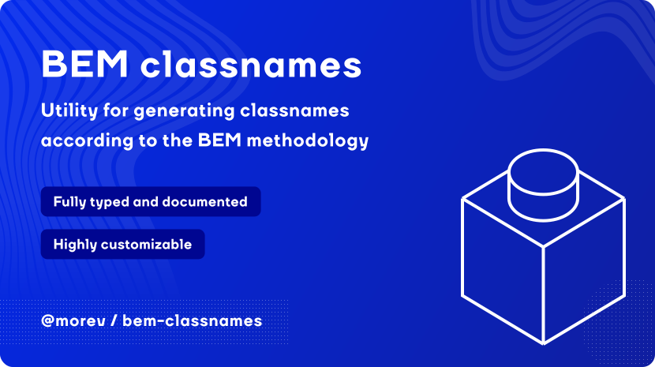

[](https://opensource.org/licenses/MIT)


# @morev/bem-classnames

Simple utility for generating classnames according to the [BEM methodology](https://en.bem.info/methodology/).

---

> **IMPORTANT:** The library is not transpiled.
>
> By keep transpiling libraries we push web backward with legacy code which is unneeded for most of the users.
>
> If you need to support legacy users, you can optionally transpile the library in your build pipeline.

---

## Installation

### Using `npm`:

```bash
npm install @morev/bem-classnames
```

### Using `yarn`:

```bash
yarn add @morev/bem-classnames
```

## Usage

Module exports a BEM classnames factory that allows flexibly customize the syntax.

Recommended usage is create and export your own `bem-factory` with options suitable for you and next use it to keep classnames consistent.
With this usage you can make module to work with any BEM-like alternative syntax.

### bem-factory.js

```js
import { bemClassnames } from '@morev/bem-classnames';

// Default options
export const bemFactory = bemClassnames({
  hyphenate: true,
  namespace: '',
  delimiters: {
    element: '__',
    modifier: '_',
    modifierValue: '_',
  },
});
```

Next, import this factory into your component, declare the `block` name and the function call will transform JS declarations into classnames:

### block.js

```js
import { bemFactory } from 'bem-factory.js';
const b = bemFactory('block');

b();
// block

b({ active: true })
// block block_active

b({ active: true, iterator: 1 })
// block block_active block_iterator_1

b({ active: true }, 'static', 'is-pinned')
// block block_active static is-pinned

b('element');
// block__element

b('element', { static: true });
// block__element block__element_static

b('element', 'static');
// block__element static
```

## Resource links

[BEM methodology](https://en.bem.info/methodology/)
